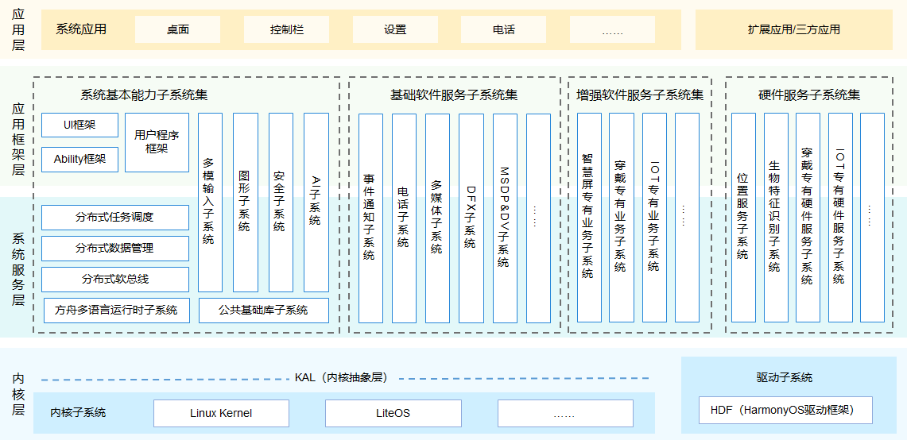

<!-- _class: cover_e -->
<!-- _paginate: "" -->
<!-- _footer:  -->
<!-- _header:  -->

# 移动应用开发 之 HarmonyOS介绍

###### “Any sufficiently advanced app is indistinguishable from magic.”

井明
数据科学与计算机学院
jingming@sdu.edu.cn
2025年秋

---

<!-- _header: 目录<br>CONTENTS<br>-->
<!-- _class: toc_b -->
<!-- _footer: "" -->
<!-- _paginate: "" -->


---

## 1. 课程介绍
- **课程目标**：掌握鸿蒙应用开发基础，理解多端部署理念  
- **学习内容**：操作系统基础、Android对比、鸿蒙应用开发流程  

---

## 2. 操作系统的基本概念
- **定义**：操作系统（OS）是管理硬件和软件资源的系统软件  
- **作用**：
  - 提供用户与计算机交互界面  
  - 调度系统资源（CPU、内存、设备）  
  - 为应用程序运行提供平台  

---

## 3. 操作系统的主要功能
- **进程管理**：任务调度、多任务切换  
- **内存管理**：地址映射、内存分配与回收  
- **文件系统**：数据持久化、层次化组织  
- **设备管理**：统一驱动接口  

💡 案例：Android 通过 **Linux 内核调度进程**，鸿蒙通过 **微内核 + 分布式调度** 来实现。  

---

## 4. 操作系统分类
- **单用户/多用户**：个人电脑 vs 服务器  
- **实时操作系统**：航天、工业控制  
- **分布式系统**：多机协同计算  

⚡ 案例：鸿蒙是面向 **IoT 和分布式计算** 的新型系统。  

---

## 5. 移动操作系统发展史
- **早期系统**：Symbian、Windows Mobile  
- **现代系统**：Android、iOS  
- **趋势**：从单一设备 → 生态化、多端互联  

---

## 6. 移动操作系统的特点
- 交互性强（触摸屏、语音）  
- 资源受限（内存、电量）  
- 功耗优化（后台任务控制）  

---

## 7. Android与iOS对比
- **Android**：开放生态，兼容性强  
- **iOS**：封闭生态，体验一致性好  
- **鸿蒙的机会**：兼顾开放性与安全性  

---

## 8. 引入鸿蒙系统
- **背景**：中美科技竞争 → 自主可控需求  
- **价值**：统一生态，多设备协同  
- **定位**：操作系统 + 分布式平台  

---

## 9. 鸿蒙系统发展背景
- 华为 2019 年发布 HarmonyOS  
- 定位 IoT，逐步扩展到手机、车机  
- **战略目标**：国产替代 + 打造新生态  

---

## 10. 鸿蒙系统架构
- **微内核**：更安全、更高效  
- **分布式架构**：跨设备资源调用  
- **服务化设计**：模块化组合  

---
📊  **架构图**（内核层、系统服务层、应用框架层）。  



---

## 11. 鸿蒙核心理念
- **一次开发，多端部署**  
- **分布式能力**：应用可在手机、手表、车机等无缝切换  
- **弹性部署**：系统可裁剪，适配不同设备  

---

## 12. 鸿蒙应用场景
- 智能手机、平板  
- 智能家居（音箱、电视）  
- 车联网、可穿戴设备  

📱 案例：手机上接听电话 → 平板/手表同步通话。  

---

## 13. 鸿蒙与Android的关系
- **兼容安卓应用**（方舟编译器）  
- **发展独立生态**（ArkUI/ArkTS）  

---

## 14. 鸿蒙的发展现状与前景
- 已覆盖 **8 亿+ 设备**（2025 数据）  
- 应用开发者快速增长  
- 挑战：生态建设、海外推广  

---

## 15. 应用开发框架
- **Stage模型**：支持复杂应用  
- **Ability 概念**：类似 Android Activity/Service  
- **UI层 + 逻辑层分离**  

---

## 16. 开发语言
- **Java**：传统应用  
- **C++**：高性能模块  
- **ArkTS**：鸿蒙官方推荐，声明式 UI  

---

## 17. 开发环境搭建
- **工具**：DevEco Studio（基于 IntelliJ IDEA）  
- **SDK配置**：API Version  
- **调试方式**：模拟器 + 真机调试  

---

## 18. 应用包结构
- `entry`：入口模块  
- `ets`：ArkTS代码  
- `resources`：资源文件（图片、布局）  

📂 案例：对比 Android `res/layout` 结构。  

---
<!-- _footer: '' -->
## 鸿蒙应用代码目录结构（Stage模型 · ArkTS）
```
AppProject/                      # 工程根目录
├── AppScope/                   # 应用全局配置
│    ├── app.json5              # 应用全局配置信息（包名、权限、设备类型等）
│    └── resources/             # 应用级资源（如图标、全局样式）
│
├── entry/                      # 默认入口模块（支持多模块）
│    ├── src/
│    │    ├── main/
│    │    │    ├── ets/         # ArkTS 源码目录
│    │    │    │    ├── entryability/      # 应用入口 Ability
│    │    │    │    │    └── EntryAbility.ts
│    │    │    │    └── pages/             # 页面目录
│    │    │    │         ├── Index.ets     # 首页
│    │    │    │         └── Detail.ets    # 详情页
│    │    │    │
│    │    │    ├── resources/   # 模块资源文件
│    │    │    │    ├── base/   # 默认资源（多语言、多分辨率）
│    │    │    │    │    ├── element/  # 字符串、颜色、样式
│    │    │    │    │    └── media/    # 图片、多媒体资源
│    │    │    │    └── rawfile/ # 原始文件资源（如json配置）
│    │    │    │
│    │    │    └── module.json5 # 模块配置（Ability、路由、权限）
│    │    │
│    │    └── test/             # 测试用例目录
│    │
│    └── build-profile.json5    # 构建配置文件（编译模式、签名等）
│
├── hvigorfile.ts               # 构建脚本（类似 Gradle）
└── build-profile.json5         # 工程构建全局配置
```
---
## 说明
- **AppScope**  
  - `app.json5`：整个应用的全局配置，例如包名、应用ID、所需权限。  
  - `resources/`：全局共享的图片、样式等资源。  

- **entry 模块**  
  - `src/main/ets/`：存放 ArkTS 源码，按照 Ability 和页面组织。  
  - `resources/base/element/`：字符串、颜色、样式资源。  
  - `resources/base/media/`：图片、音频等资源。  
  - `module.json5`：模块级配置（Ability 声明、路由信息）。  

- **多模块支持**：鸿蒙应用可以有多个业务模块，例如 `entry`（入口）、`feature_xxx`（业务模块）。  
---
<!-- _footer: '' -->
## Android 项目资源目录结构（res/layout 部分）
```
app/
└── src/
└── main/
├── java/                  # Java/Kotlin 源代码
├── res/                   # 资源文件目录
│    ├── drawable/         # 图片资源（.png, .jpg, .xml 等）
│    ├── mipmap/           # 启动图标资源
│    ├── layout/           # 布局文件目录
│    │    ├── activity_main.xml      # 主界面布局
│    │    ├── fragment_home.xml      # 首页 Fragment 布局
│    │    ├── item_list.xml          # RecyclerView 列表项布局
│    │    ├── dialog_custom.xml      # 自定义对话框布局
│    │    └── include_toolbar.xml    # 可复用的工具栏布局
│    │
│    ├── values/           # 字符串、颜色、样式等资源
│    ├── menu/             # 菜单资源
│    ├── xml/              # 额外配置文件（如权限、导航等）
│    └── anim/             # 动画资源
│
└── AndroidManifest.xml    # 应用清单文件
```
---

### 说明：
- **`res/layout/`**：保存所有界面布局 XML 文件。  
- **常见命名规范**：  
  - `activity_xxx.xml` → 对应 Activity 的布局  
  - `fragment_xxx.xml` → 对应 Fragment 的布局  
  - `item_xxx.xml` → 列表或网格项布局  
  - `dialog_xxx.xml` → 对话框布局  
  - `include_xxx.xml` → 可复用布局  
---

## 19. 界面开发基础
- **ArkUI 声明式 UI**：代码即界面  
- 支持组件化、响应式编程  

```ts
@Entry
@Component
struct Hello {
  build() {
    Text("Hello HarmonyOS").fontSize(20)
  }
}
```

---

## 20. 事件处理与交互

•	按钮点击事件
•	触摸、拖拽手势
•	UI状态更新

案例：实现 按钮点击计数器。
// 文件路径: entry/src/main/ets/pages/Index.ets

---
<!-- _footer: '' -->
```
@Entry
@Component
struct Index {
  // 定义一个状态变量 count
  @State count: number = 0

  build() {
    Column({ space: 20 }) {
      // 标题文字
      Text(`点击次数: ${this.count}`)
        .fontSize(24)
        .fontWeight(FontWeight.Bold)
        .margin({ top: 50 })

      // 按钮
      Button(`点我一下`)
        .fontSize(20)
        .backgroundColor('#4CAF50')
        .fontColor(Color.White)
        .borderRadius(12)
        .width(200)
        .height(60)
        .onClick(() => {
          this.count += 1   // 每点击一次按钮，计数+1
        })
    }
    .width('100%')
    .height('100%')
    .justifyContent(FlexAlign.Center)
    .alignItems(HorizontalAlign.Center)
    .backgroundColor('#F5F5F5')
  }
}
```
---

📌 功能说明
	•	@Entry：声明该页面为应用入口。
	•	@State count：定义状态变量，自动触发 UI 更新。
	•	Text：显示点击次数。
	•	Button：点击后触发 onClick 事件，使 count+1。
	•	Column：垂直布局容器，设置了间距和居中对齐。

运行效果：
	•	初始显示 点击次数: 0。
	•	每点击一次按钮，数字会自增。

---

## 21. 应用生命周期
•	Ability 生命周期：创建、运行、销毁
•	Page 生命周期：页面加载、显示、卸载

案例：音乐播放器后台运行 → 生命周期管理。

---

## 22. 数据存储
•	Preferences：小型键值对存储
•	数据库 RDB：SQLite 风格
•	文件存储：媒体文件

---

## 23. 系统权限与安全机制
•	权限声明：在配置文件中申请
•	运行时授权：用户确认
•	安全设计：微内核减少攻击面

---

## 24. 简单应用示例

案例：计数器 APP

```ts
@Entry
@Component
struct Counter {
  @State count: number = 0
  build() {
    Column() {
      Text(`点击次数: ${this.count}`)
      Button("点我").onClick(() => this.count++)
    }
  }
}
```

---

25. 应用结构对比
	•	Android 四大组件：Activity、Service、Broadcast、ContentProvider
	•	鸿蒙 Ability 模型：UIAbility、ServiceAbility

---

26. UI框架对比
	•	Android：XML布局
	•	鸿蒙：ArkUI 声明式UI（类似 Flutter/React）

---

27. 开发语言对比
	•	Android：Java/Kotlin
	•	鸿蒙：Java/ArkTS

---

28. 开发环境对比
	•	Android Studio（Google）
	•	DevEco Studio（华为）

---

29. 应用生态对比
	•	Google Play → 全球生态
	•	华为应用市场 → 中国市场

---

30. 跨平台与兼容性
	•	兼容安卓应用（通过方舟编译器）
	•	多端适配（手机/平板/车机）

---

31. 分布式能力
	•	多设备协同 → 手机拍照，电视展示
	•	跨设备调用 API

---

32. 多端部署
	•	一次开发 → 手机/平板/手表同时适配
	•	自适应 UI 布局

---

33. 常用API与服务调用
	•	相机 API
	•	蓝牙通信
	•	位置服务

📱 案例：定位应用，结合地图服务。

---

34. 系统资源管理
	•	内存优化：垃圾回收、对象池
	•	功耗控制：后台任务冻结

---

35. 应用测试与调试
	•	模拟器调试
	•	日志打印 (hilog)
	•	单元测试

---

36. 应用打包与发布
	•	HAP 包格式
	•	应用签名
	•	华为应用市场发布流程

---

37. 鸿蒙生态发展趋势
	•	IoT 融合：智能家居、车联网
	•	AI 驱动：语音助手、图像识别

---

38. 鸿蒙与AI/IoT结合
	•	智能家居案例：灯光、温控统一控制
	•	车联网案例：手机无缝切换导航到车机
	•	可穿戴案例：健康监测数据同步

---

39. 学习路径与资源
	•	官方文档：HarmonyOS Developer
	•	开源项目：GitHub/ Gitee
	•	技术社区：华为开发者联盟

---

40. 课程总结与讨论
	•	重点回顾：操作系统基础、鸿蒙开发框架
	•	未来趋势：IoT + AI
	•	思考题：
	1.	鸿蒙与 Android 的根本差异是什么？
	2.	多端部署给应用设计带来哪些挑战？

---

## 操作系统内核的基本概念

- **内核 (Kernel)**  
  操作系统的核心部分，负责管理硬件资源和系统服务。  
- 核心功能：  
  - 进程管理  
  - 内存管理  
  - 文件系统  
  - 设备驱动  
  - 系统调用接口  

---

## 宏内核（Monolithic Kernel）的定义

- 将操作系统的绝大多数功能放在内核态中运行。  
- 内核体积大，所有核心服务集成在一起。  
- 系统调用与服务之间切换开销小，性能高。  

---

## 宏内核的特点

- **优点**：
  - 性能高，系统调用开销小。
  - 内核模块之间通信效率高。
- **缺点**：
  - 内核庞大、复杂。
  - 安全性差，一个模块崩溃可能导致整个系统宕机。
  - 可扩展性较差。

---

## 宏内核的典型案例

- **Linux**  
  - 属于宏内核架构。  
  - 提供丰富的文件系统、设备驱动支持。  
  - 通过“可加载内核模块（LKM）”机制增强灵活性。  

- **UNIX**  
  - 经典的宏内核设计。  
  - 稳定、高效，广泛应用于服务器和工作站。

---

## 微内核（Microkernel）的定义

- 仅将操作系统最基本的功能放入内核：  
  - 进程间通信（IPC）  
  - 进程调度  
  - 基础内存管理  
- 其他功能（驱动、文件系统、网络协议）运行在用户态。  

---

## 微内核的特点

- **优点**：
  - 内核小，安全性高。
  - 一个模块崩溃不会导致整个系统崩溃。
  - 易于移植和扩展。  

- **缺点**：
  - IPC 通信频繁，性能开销大。
  - 系统调用效率低于宏内核。  

---

## 微内核的典型案例

- **HarmonyOS (鸿蒙系统)**  
  - 采用微内核架构。  
  - 驱动、文件系统、网络栈均运行在用户态。  
  - 具备高安全性和跨设备扩展能力。  

- **QNX**  
  - 典型的实时微内核系统。  
  - 广泛用于汽车、航空、工业控制领域。  

---

## 宏内核与微内核对比

| 特性          | 宏内核               | 微内核              |
|---------------|----------------------|---------------------|
| 内核大小      | 大                   | 小                  |
| 性能          | 高                   | 相对较低            |
| 安全性        | 较低                 | 高                  |
| 可扩展性      | 一般                 | 强                  |
| 应用场景      | 通用计算机、服务器   | 嵌入式、分布式系统  |

---

## 案例对比：Linux vs 鸿蒙

- **Linux (宏内核)**  
  - 应用在服务器、桌面、超级计算机。  
  - 性能极高，但内核复杂。  

- **HarmonyOS (微内核)**  
  - 应用于手机、IoT设备、车载系统。  
  - 更注重安全性与分布式场景。  

---

## 案例延伸：QNX与汽车操作系统

- **QNX**  
  - 微内核架构，支持实时响应。  
  - 广泛应用于 **自动驾驶系统**、**车载娱乐系统**。  
- 案例：  
  - 奥迪、宝马、福特等品牌使用 QNX 作为车载系统核心。  

---

## 总结

- **宏内核**：性能优先，常用于 PC 和服务器。  
- **微内核**：安全性、扩展性优先，常用于嵌入式与物联网。  
- **趋势**：  
  - 随着 IoT 和分布式计算兴起，**微内核**逐渐受到重视。  
  - 宏内核依然主导桌面和服务器市场。  

---

## 思考题

1. 为什么鸿蒙系统选择微内核而不是宏内核？  
2. 在 IoT 场景下，微内核的优势主要体现在哪些方面？  
3. 如果要开发一个高性能游戏操作系统，你会选择哪种内核架构？


